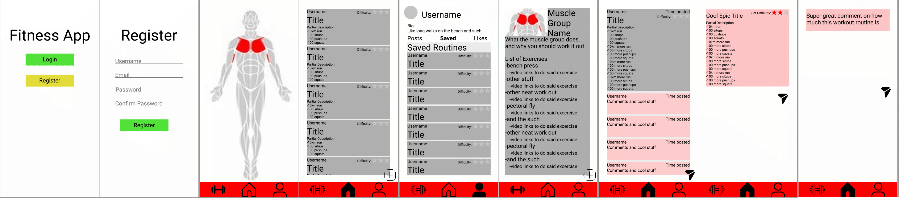

# Quick-Fitness
## Table of Contents
1. [Overview](#Overview)
1. [Product Spec](#Product-Spec)
1. [Wireframes](#Wireframes)

## Overview
### Description
Gives users information about muscle groups and how to work them out. Allows them to make work out routines and share with other users as well.

### App Evaluation
- **Category:** Fitness / Social Networking
- **Mobile:** This app would be primarily developed for mobile but could be viable on pcs. Functionality wouldn't be limited to mobile devices, however mobile version could potentially have more features.
- **Story:** Users could post their tips and full workouts to get others motivated and into the spirit of fitness.
- **Market:** Anyone who wants to work out and share their experiences.
- **Habit:** This app could be used as often or unoften as the user wants. We think that their fitness should be their choice and we want to make it easy and accesable for them to get into.
- **Scope:** First we would start with giving them information on workouts, letting them share their routines. Then we would want more user interactions so letting people make fitness groups where they can track their progress and compare and share within the group.

## Product Spec
### 1. User Stories (Required and Optional)


**Required Must-have Stories**

- [x] User logs in to access app.
- [x] User can navigate different screens with bottom navigation view
- [ ] User picks what body part they want to work out, and gets a list of workouts, and videos to follow.
- [ ] Users can can view and post routines and progress.
- [ ] Profile pages for each user
- [ ] Settings (Accesibility, Notification, General, etc.)

**Optional Nice-to-have Stories**

- [ ] Let user set custom sets and reps
- [ ] Chat functionality between users
- [ ] Allow users to add workouts to body parts
- [ ] Allow users to track progress
- [ ] Allow users to track and modify sets and reps


### 2. Screen Archetypes

* Login 
* Register - User signs up or logs into their account
   * Upon Download/Reopening of the application, the user is prompted to log in to gain access to their profile information and interact with others 
* Messaging Screen - Chat for users to communicate (direct 1-on-1)
   * Let users communicate and share their workout plans and fun exercises
* Profile Screen 
   * Allows user to view their posts, saved routines, upload a photo and fill in information that is interesting to them and others.
* Muscle Selection Screen
   * Allows user to select the muscle group that they would like to work out. Also be able to choose their desired muscle, artist, genre of preference and begin listening and interacting with others..
* Wourkout Information Screen
    * Gives info on the muscle group and lists exercises to do to build that muscle up. Also gives video references to help you follow along.
    * record your sets and reps for each session

### 3. Navigation

**Tab Navigation** (Tab to Screen)

* Muscle selection
* Feed
* Share workouts
* Profile

Optional:
* Let user comment on post
* Let user modify sets and reps

**Flow Navigation** (Screen to Screen)
* Forced Log-in -> Account creation if no log in is available.
* Muscle Selection -> Jumps to excercise list/videos.
* Feed -> view details of post.
* Share workouts -> Create workout plan and post to feed.
* Profile -> Text field to be modified.
* Profile -> Edit past posts.

## Schema
### Models
#### User

   | Property      | Type     | Description |
   | ------------- | -------- | ------------|
   | objectId      | String   | unique id for the User (default field) |
   | username        | String | user's display name |
   | password         | String     | user's password |
   | email         | String     | user's email |
   | profilePicture | Image | user's uploaded profile picture, or default picture |
   | bio         | String     | short description of the user's bio |

#### SavedRoutines
**Query by matching user.objectId to SavedRoutines.ownerId, then matching SavedRoutines.routineId to Routine.objectId**
   | Property      | Type     | Description |
   | ------------- | -------- | ------------|
   | objectId      | String   | unique id for the SavedRoutines (default field) |
   | ownerId        | Pointer to User| id of user who saved a routine  |
   | routineId         | Pointer to Routine     | id of the routine the user wished to save |

#### LikedRoutines
**Query by matching user.objectId to LikedRoutines.ownerId, then matching SavedRoutines.routineId to Routine.objectId**
   | Property      | Type     | Description |
   | ------------- | -------- | ------------|
   | objectId      | String   | unique id for the LikedRoutines (default field) |
   | ownerId        | Pointer to User| id of user who liked a routine  |
   | routineId         | Pointer to Routine     | id of the routine the user wished to like |

#### Routine

   | Property      | Type     | Description |
   | ------------- | -------- | ------------|
   | objectId      | String   | unique id for the Routine (default field) |
   | author        | Pointer to User| id of routine author |
   | title       | String   | routine title by author |
   | description       | String   | routine description by author |
   | difficulty    | Number   | difficulty rating for the routine |
   | likes    | Number   | number of likes for the routine |
   | createdAt     | DateTime | date when post is created (default field) |
   | updatedAt     | DateTime | date when post is last updated (default field) |

#### Comment

   | Property      | Type     | Description |
   | ------------- | -------- | ------------|
   | objectId      | String   | unique id for the Comment (default field) |
   | author        | Pointer to User| id of comment author |
   | text | String | text body of the comment |
   | parentRoutine | Pointer to Routine | id of routine this comment was replying to |
   | createdAt     | DateTime | date when post is created (default field) |
   | updatedAt     | DateTime | date when post is last updated (default field) |

#### MuscleGroup

   | Property      | Type     | Description |
   | ------------- | -------- | ------------|
   | objectId      | String   | unique id for the MuscleGroup (default field) |
   | name | String | the name of the muscle group |
   | description | String | what the muscle group does and why you should work it out |


#### Exercise

   | Property      | Type     | Description |
   | ------------- | -------- | ------------|
   | objectId      | String   | unique id for the Exercise (default field) |
   | name | String | name of the exercise |
   | videoLink | String | link to a demonstration of the exercise |
   | muscle | Pointer to MuscleGroup | id of the MuscleGroup that the exercise works out |

### Networking
#### List of network requests by screen
   - Home Feed Screen
      - (Read/GET) Query all posts
         ```
          ParseQuery<Post> query = ParseQuery.getQuery(Post.class);
          query.include(Post.KEY_USER);
          query.setLimit(20);
          query.addDescendingOrder(Post.KEY_CREATED);
          query.findInBackground(new FindCallback<Post>() {
            @Override
            public void done(List<Post> posts, ParseException e) {
                if(e != null){
                    Log.e(TAG, "Issue getting posts", e);
                }
                for (Post post: posts){
                    Log.i(TAG, "Post: " + post.getDescription() +", USERNAME: " + post.getUser().getUsername());
                }
         ```
      - (Create/POST) Create a new like on a post
      - (Delete) Delete existing like
   - Post Detail Screen
      - (Read/GET) Query post object
      - (Read/GET) Query all comments under post object
      - (Create/POST) Create a new comment on a post
      - (Delete) Delete existing comment
   - Create Post Screen
      - (Create/POST) Create a new post object
          ```
          Post post = new Post();
          post.setDescription(description);
          post.setImage(new ParseFile(photoFile));
          post.setUser(currentUser);
          post.saveInBackground(new SaveCallback() {
            @Override
            public void done(ParseException e) {
                if(e != null){
                    Log.e(TAG, "Error while saving!",e);
                    Toast.makeText(getContext(), "Error while saving!", Toast.LENGTH_SHORT).show();
                }
                Log.i(TAG, "Post save was successful");
                etDiscription.setText("");
                ivPostImage.setImageResource(0);
            }
        });
          ```
   - Exercise Screen
      - (Read/GET) Query all exercise object where muscle group is equal to muscle button clicked
   - Profile Screen
      - (Read/GET) Query logged in user object
      - (Update/PUT) Update user profile image
      - (Read/GET) Query all posts where user is author 
         ```
          ParseQuery<Post> query = ParseQuery.getQuery(Post.class);
          query.include(Post.KEY_USER);
          query.whereEqualTo(Post.KEY_USER, ParseUser.getCurrentUser());
          query.setLimit(20);
          query.addDescendingOrder(Post.KEY_CREATED);
          query.findInBackground(new FindCallback<Post>() {
            @Override
            public void done(List<Post> posts, ParseException e) {
                if(e != null){
                    Log.e(TAG, "Issue getting posts", e);
                }
                for (Post post: posts){
                    Log.i(TAG, "Post: " + post.getDescription() +", USERNAME: " + post.getUser().getUsername());
                }
         ```
       - (Read/GET) Query all posts where user has liked
       - (Read/GET) Query all posts where user has saved
       
       
## Basic Wireframe


### Top Ideas
#Fitness Tracker - with each body part, and it gives you a list of excercises to do and videos
#Body figure with clickable muscles that take you to the muscle explinations, and excercises
#easy medium and hard levels for exercises and a custom sets and reps option
#fragments for videos, and another for sets and reps, another for a social aspects (sharing workouts and such)
* videos/home fragment features:
    * body part ui/main menu
    * top five exercises for that muscle
    * videos for each of those exercises
* log fragment features:
    * local or account based storage
    * record your sets and reps for each session
* social fragment features:
    * sharing workouts and routines
    * feed with parse

### Other Ideas
#News app, and it gives local news based on on your area, watchlist feature
#Car app, enter model year, and gives the look of the car
#Instagram
#Craigslist(but for one thing)
#Recipe App- grocery List, some premade recipes, users can create their own, filter by the type of food
#Monster Hunter Set Builder - lets users build sets based on what skills they want

Fitness-- iii
news--
car--
insta--
Craigs--
Recipe--ii
Monst Hunt--ii
